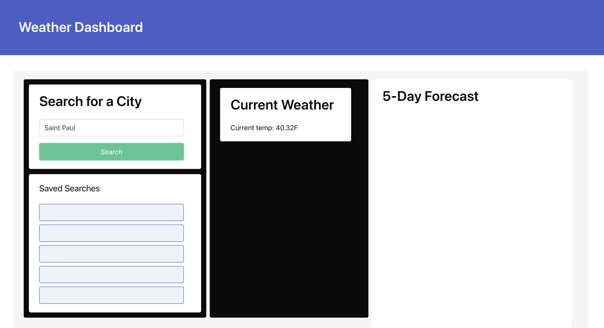

# Weather Dashboard

## Objective

The objective was to create a weather dashboard with form inputs where a user can search weather forecasts for multiple cities. After searching a city, the dashboard should show current weather conditions as well as the 5-day forecast for that city. When the user searches a new city, the previous one is saved to the search history. When the user clicks on a city in the search history, that city's weather data is again displayed for the user.

In addition, I'm learning Bulma as a new techonlogy for a group project and decided to inmplement what I've learned into the styling for this project as well. (Bulma is a free open-source library that works with Flexbox to make application styling simple, efficient, and elegant.)

## What I Learned

Mainly what I learned here is to balance priorities so I don't miss a deadline. I'll get this project done but not in time expected timeframe, mainly due to being overly focused on a different project.

## Link to Published Repo

## Screenshot

